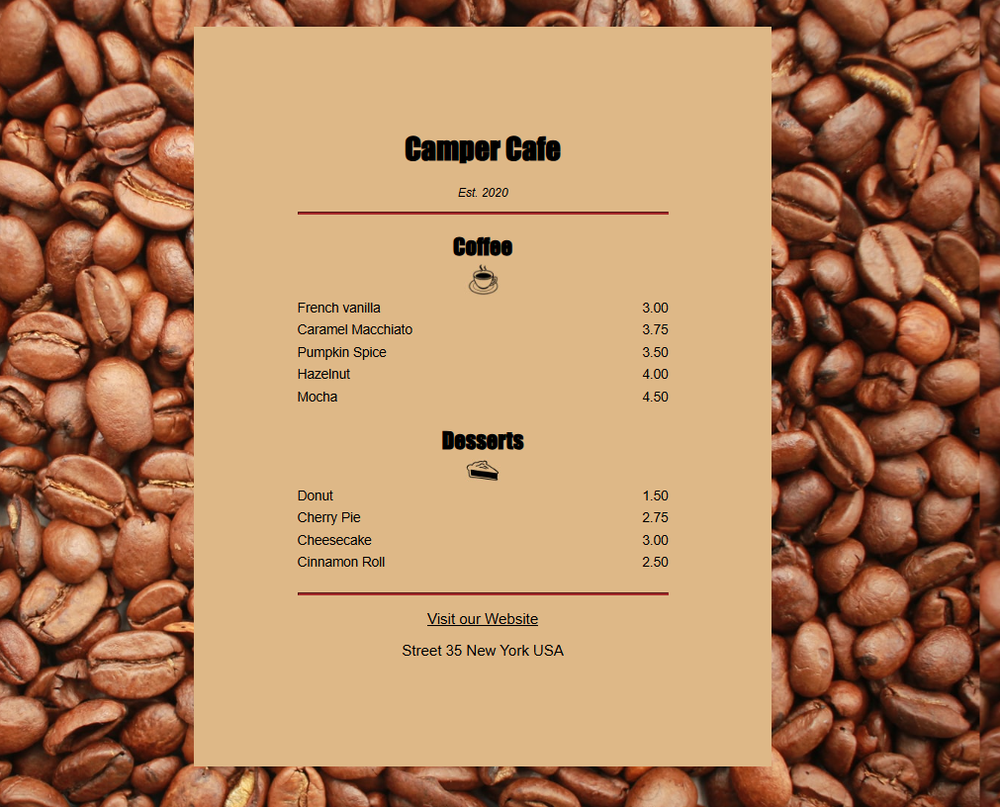

# Camper Cafe Menu Website

A Camper Cafe menu website built using HTML and CSS

## Features
- Responsive design
- Clean, rustic cafe theme
- Interactive hover effects
- Coffee and dessert menu sections

## Technologies Used
- HTML5
- CSS3

## Live Demo
[View Live Site](https://Talhaarif326.github.io/camper-cafe-menu)

## Screenshot

## How to Use
1. Clone this repository
2. Open `index.html` in your browser
3. Enjoy browsing the menu!
